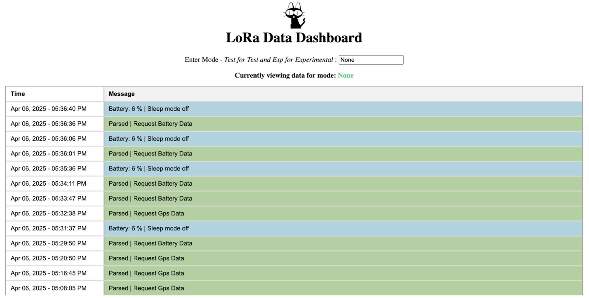
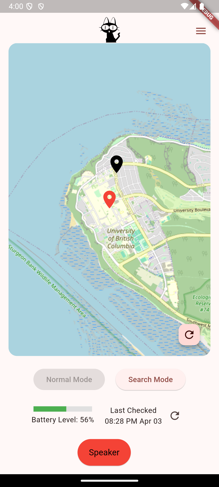

LoRa Pet Tracker
=========

A low-power, LoRa-based pet tracking system that transmits GPS and activity data from a collar-mounted node to a base station, which relays the information to a visual dashboard and mobile app.


---

Project Structure
=========

```bash
lora-pet-tracker/
├── node/              # Microcontroller code for pet collar node
├── base/              # Base station MCU code and Python dashboard scripts
├── app/       # Mobile app built with Flutter
```

Node Firmware (`node/`)
=========

This firmware runs on a GPS + IMU + LoRa-equipped microcontroller worn by the pet. This includes:

- GPS data acquisition & compression
- IMU-based wake/sleep logic
- LoRa packet transmission (~912.5 MHz)
- Battery level monitoring
- Remote buzzer control
- Normal/Search mode toggle


For more detailed information, check out the seperate README in the /node folder

Base Station (`base/`)
=========

The base station receives LoRa packets and relays them to Supabase (PostgreSQL backend). Optionally, it can visualize activity via a Python dashboard.




This includes the following features. For more detailed information, check out the seperate README in the /base folder
- LoRa reception & decoding
- Command transmission to node
- Real-time dashboard (optional)
- Supabase integration for cloud logging


Mobile App (`app/`)
=========
A Flutter-based mobile dashboard to view location, battery, and command the node remotely.


This includes the following features.

- Real-time location & battery updates
- Historical GPS view
- Sleep/Active status
- Remote buzzer activation
- Normal/Search mode toggle


Data Flow Overview
=========


```mermaid
graph LR
A[Pet Node] -- LoRa --> B[Base Station]
B -- UART/I2C --> C[Python Script]
C -- REST --> D[Supabase (PostgreSQL)]
D --> E[Flutter App]
```

PostgreSQL Table Snapshot
=========

| Column           | Type      | Description                   |
|------------------|-----------|-------------------------------|
| gps_latitude     | float     | Latitude in degrees           |
| gps_longitude    | float     | Longitude in degrees          |
| battery_level    | float     | Battery percentage            |
| sleep            | boolean   | True if pet is asleep         |
| timestamp        | datetime  | When data was recorded        |
| device_id        | int       | 0 (real), 1 (test), etc.      |

---

Demo Screenshots
=========
<p align="center">
  
  
</p>
