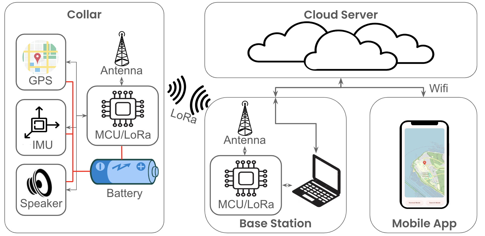
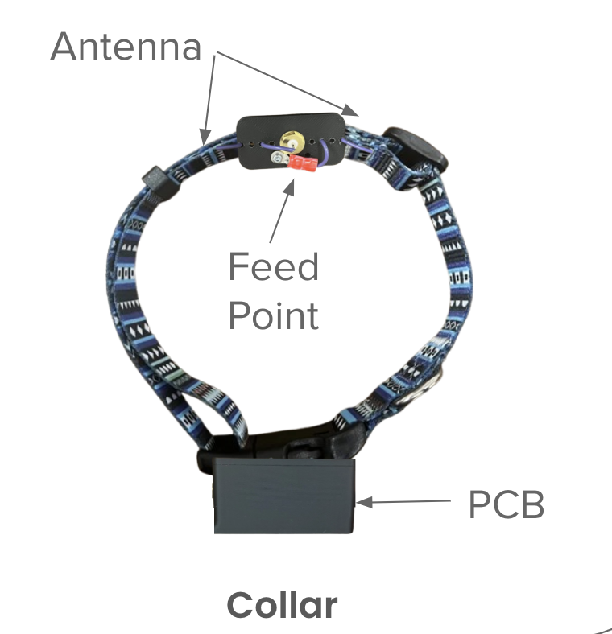
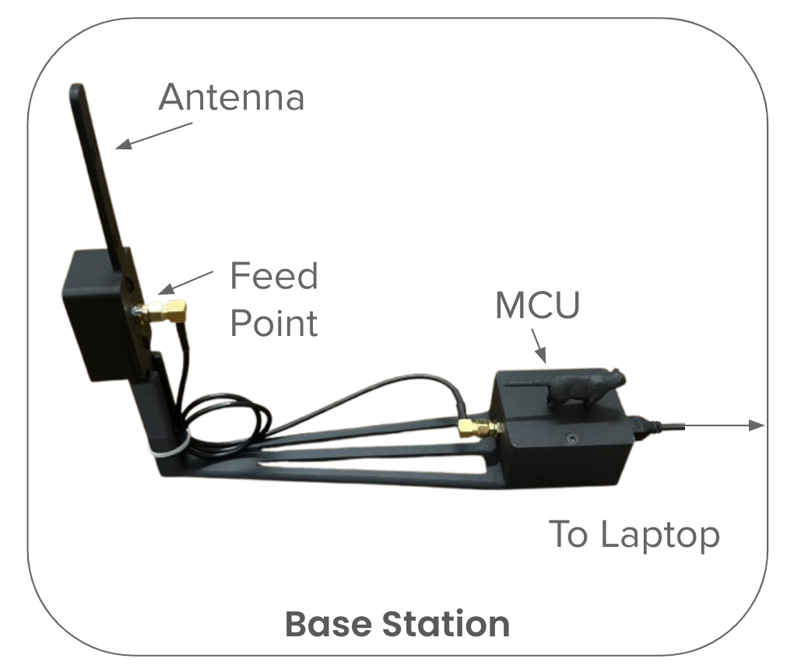
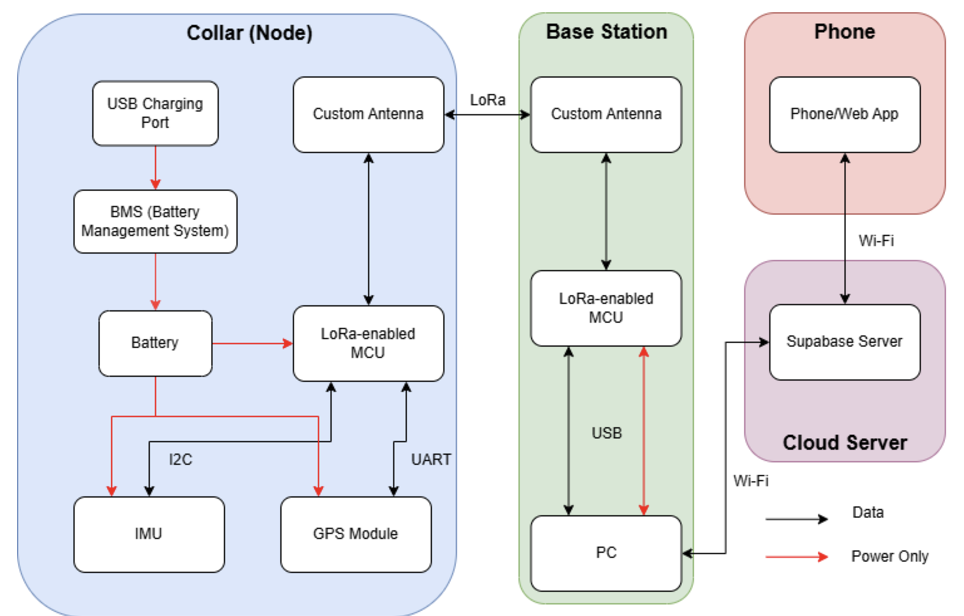
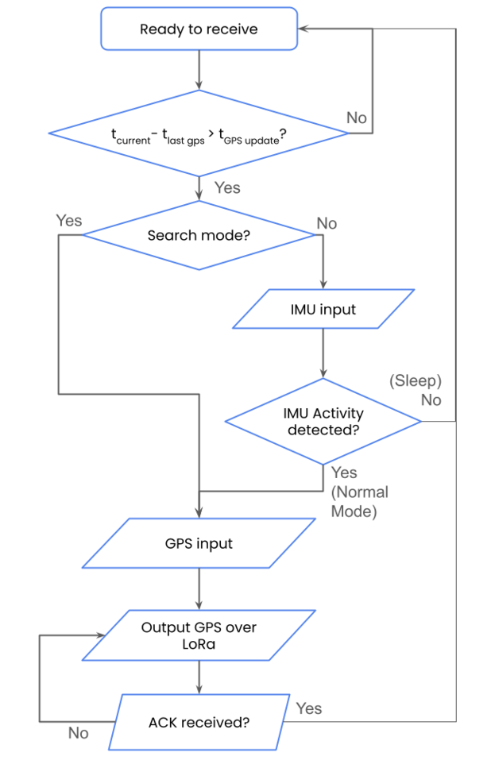
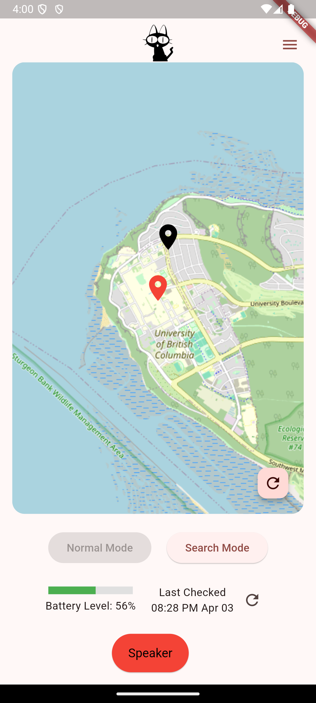
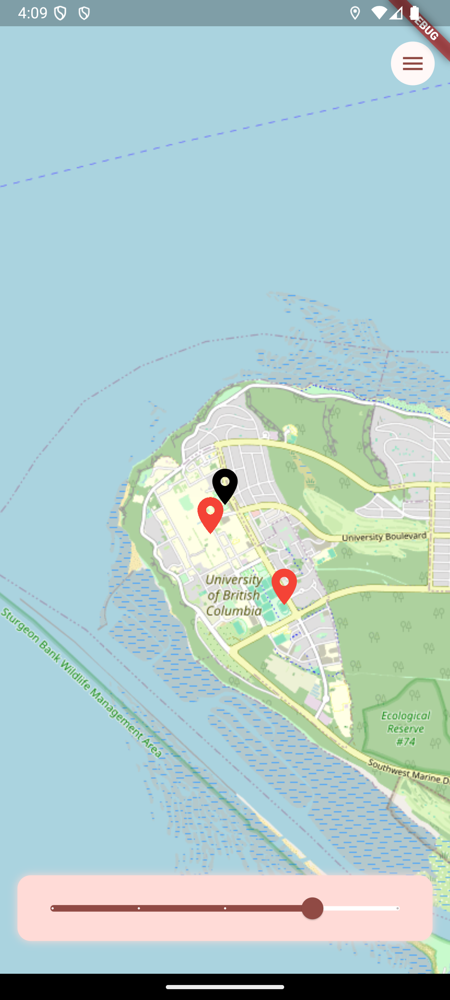

LoRa Pet Tracker
=========

A low-power, LoRa-based pet tracking system that transmits GPS and activity data from a collar-mounted node to a base station, which relays the information to a visual dashboard and mobile app.



---

Project Structure
=========

```bash
lora-pet-tracker/
├── node/              # Microcontroller code for pet collar node
├── base/              # Base station MCU code and Python dashboard scripts
├── app/       # Mobile app built with Flutter
```

Node Firmware (`node/`)
=========

This firmware runs on a GPS + IMU + LoRa-equipped microcontroller worn by the pet. This includes:

- GPS data acquisition & compression
- IMU-based wake/sleep logic
- LoRa packet transmission (~912.5 MHz)
- Battery level monitoring
- Remote buzzer control
- Normal/Search mode toggle



For more detailed information, check out the seperate README in the /node folder

Base Station (`base/`)
=========

The base station receives LoRa packets and relays them to Supabase (PostgreSQL backend).



This includes the following features. For more detailed information, check out the seperate README in the /base folder
- LoRa reception & decoding
- Command transmission to node
- Real-time dashboard (optional)
- Supabase integration for cloud logging

Mobile App (`app/`)
=========
A Flutter-based mobile application to view location, battery, and command the node remotely. It is accessible both on iOS and Android.

<div align="center">
  <figure>
    
  </figure>
</div>
</br>

This includes the following features:

- Real-time location & battery updates
- Historical GPS view
- Sleep/Active status
- Remote buzzer activation
- Normal/Search mode toggle

Data Flow Overview
=========


Below is the node-side logic flowchart for LoRa GPS transmission. The node periodically evaluates whether a GPS update is required based on elapsed time. If in Search Mode, GPS is transmitted immediately. In Normal Mode, IMU activity is used to determine if the node is awake and should proceed with GPS transmission. All transmissions await an acknowledgment (ACK) to confirm delivery.

<div align="center">
  <figure>
    
  </figure>
</div>
</br>

PostgreSQL Table Snapshot
=========

Below are the example tables for device status and device commands.

<div align="center">

| Column           | Type      | Description                   |
|------------------|-----------|-------------------------------|
| gps_latitude     | float     | Latitude in degrees           |
| gps_longitude    | float     | Longitude in degrees          |
| battery_level    | float     | Battery percentage            |
| sleep            | boolean   | True if pet is asleep         |
| timestamp        | datetime  | When data was recorded        |
| device_id        | int       | 0 (real), 1 (test), etc.      |

</div>
</br>
<div align="center">

| Column      | Type        | Description                                 |
|-------------|-------------|---------------------------------------------|
| id          | uuid        | Unique identifier for each command          |
| device_id   | text        | ID of the device receiving the command      |
| status      | bool        | Whether the command has been acknowledged   |
| buzzer      | bool        | Activate (true) or deactivate (false) buzzer |
| mode        | text        | Set mode: e.g., `"n"` for normal, `"s"` for search |
| battery     | bool        | Request battery level if true               |
| timestamp   | timestamptz | When the command was sent                   |
| gps         | bool        | Request GPS data if true                    |

</div>


Demo Screenshots
=========
<p align="center">
  
  
</p>

Questions and help
==================
If you have any questions and help, feel free to reach out to the LoRa Pet Tracker Team, Emily, Lauryn, Margaret, and Anqi!
