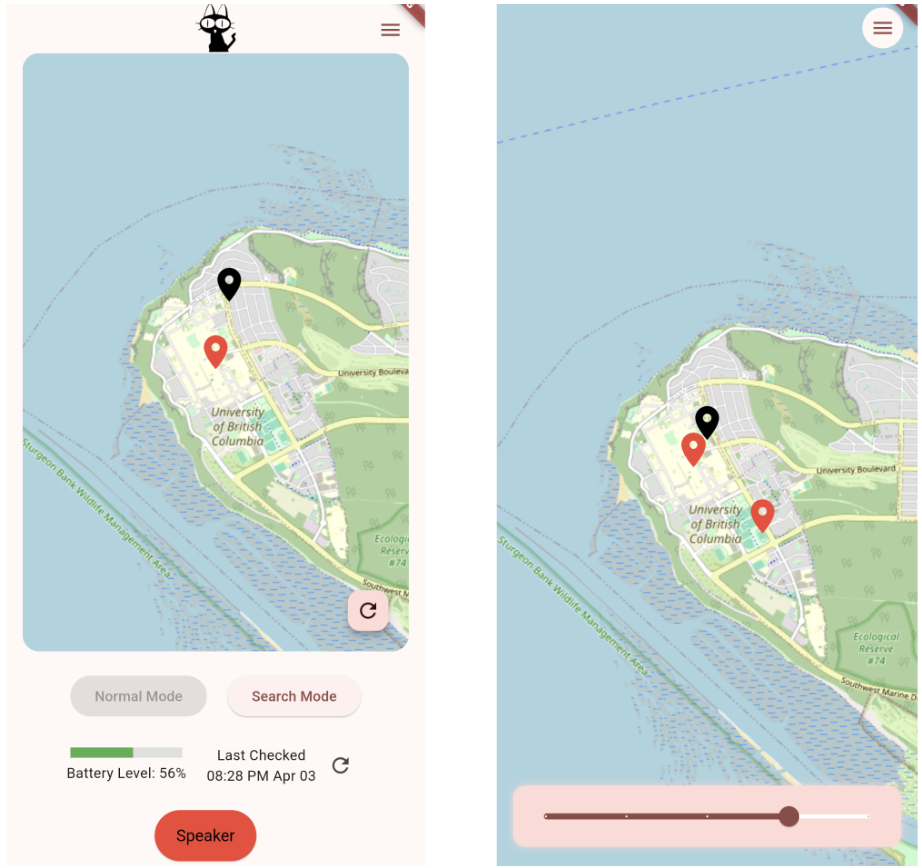

LoRa Pet Tracker
=========

The **LoRa Pet Tracker** is a Flutter-based mobile application designed to help pet owners track their pets' location in real-time using LoRa (Long Range) technology. The app integrates with a Supabase backend to fetch GPS data, battery levels, and send commands to the pet tracker device.

Features 
=========
**Real-time GPS Tracking**: View your pet's location on an interactive map.  

**Battery Level Monitoring**: Check the battery status of the pet tracker device.  

**Speaker Control**: Trigger a speaker on the device to help locate your pet.  

**Mode Selection**: Switch between **Normal Mode** and **Search Mode** for different tracking scenarios.  

**History**: View historical location data of your pet.

<div align="center">
  <figure>
    
  </figure>
</div>
</br>

Installation
=========

Before running the app, ensure you have the following, and update keys as needed.

- [**Flutter SDK**](https://docs.flutter.dev/get-started/install) installed (version 3.0 or higher)
- [A **Supabase account**](https://supabase.com/dashboard/sign-up) with a project set up.

To install, follow the following:

1. Clone the repository:
   ```bash
   git clone https://github.com/your-username/lora-pet-tracker.git
   cd lora-pet-tracker
   ```

2. Install dependencies:
   ```bash
   flutter pub get
   ```

3. Set up Supabase:
   - Replace the `url` and `anonKey` in the `main.dart` file with your Supabase project credentials.
   - Ensure your Supabase database has the following tables:
     - `device_status`: Stores GPS data, battery levels, and timestamps.
     - `device_commands`: Stores commands sent to the device (e.g., buzzer, mode).

4. Run the app:
   ```bash
   flutter run
   ```

Usage 
=========
<p align="center">
  
</p>

On the home screen there is a the following:
- Map which displays your pet's current location and the latest GPS data.
- Battery Indicator which shows the battery level of the pet tracker device.
- Speaker Button that triggers a buzzer on the device to help locate your pet.
- Mode Selection that allows you to toggle between Normal Mode and Search Mode.

The app also has a history page (right), where you can view historical GPS data of your pet's movements on the map.

Code Structure 
=========
- **`main.dart`**: Entry point of the app. Initializes Supabase and sets up the app state.
- **`MyAppState`**: Manages the app's state, including GPS data, battery levels, and device commands.
- **`MyHomePage`**: Main screen with navigation rail for switching between Home and History.
- **`MainPage`**: Displays the map, battery level, and speaker controls.
- **`HistoryPage`**: Shows historical GPS data on the map.
- **`BatteryIndicator`**: A widget to display the battery level.
- **`ModeSelectionWidget`**: Allows users to switch between Normal and Search modes.

Dependencies 
=========
The app uses the following Flutter packages:

- **`flutter_map`**: For displaying interactive maps.
- **`supabase_flutter`**: For backend integration.
- **`geolocator`**: For fetching the user's current location.
- **`latlong2`**: For handling latitude and longitude coordinates.
- **`intl`**: For formatting dates and times.

Questions and help
==================
If you have any questions and help, feel free to reach out to the LoRa Pet Tracker Team!
