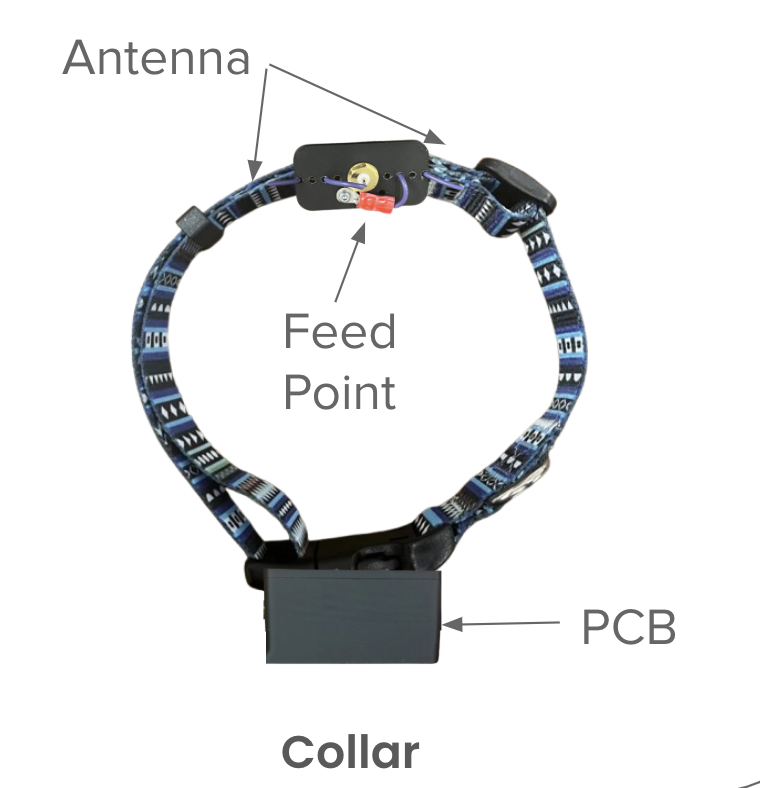

LoRa Pet Tracker Node 
=========

Features
=========
This repository contains the firmware for the LoRa-enabled pet tracker node, designed to collect and transmit location and activity data to a base station. The system is energy-aware and features GPS, IMU-based wake/sleep control, and buzzer functionality for pet location assistance.



Some of the features we plan to implement are
- GPS data collection with efficient wake/sleep cycles  
- LoRa communication to base station at ~912.5 MHz  
- Inertial Motion Unit (IMU)-based activity detection  
- Battery level reporting  
- Remote buzzer control for pet location  
- Configurable normal/search modes

Initialization
=========

1. Clone the repo:
   ```bash
   git clone https://github.com/anqixxx/lora-pet-tracker.git
   cd lora-pet-tracker/node
   ```

2. Open `node.ino` using Arduino IDE or another platform compatible with your MCU.

3. Install the following libraries via Library Manager:
   - `Adafruit_GPS`
   - `Adafruit_I2CDevice`
   - `LSM6DS`
   - `RadioHead`
   - `Wire`, `SPI`

4. Upload the sketch to your board.


Communication Protocol
=========

| Message Type       | ID  | Description                        |
|--------------------|-----|------------------------------------|
| ACK                | 0   | Acknowledgment of received packet  |
| SEND_GPS           | 1   | Transmit current GPS data          |
| REQUEST_GPS        | 2   | Request GPS data from node         |
| MODE_TOGGLE        | 3   | Toggle between normal/search mode  |
| SPEAKER_ON         | 4   | Enable the pet's buzzer            |
| SPEAKER_OFF        | 5   | Disable the buzzer                 |
| SEND_BATTERY       | 6   | Transmit battery status            |
| REQUEST_BATTERY    | 7   | Request battery status from node   |
| SLEEP              | 8   | Enter sleep mode                   |


Firmware Behavior
=========
- Sends GPS data periodically (1 hr default in normal mode, 20s in search mode)
- Uses IMU activity detection to conserve power while pet is idle
- Responds to base station commands (e.g., speaker toggle, battery request)
- Retries transmissions until acknowledged by the base station
- Places GPS module in sleep mode when not in use

Notes
=========
- Ensure the GPS antenna is exposed for best signal.
- The LoRa spreading factor and frequency must match the base station.
- Tune `period` and `searchToggle` logic based on real-world testing.
